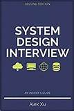

# IT Bookworm

I am a professional Cloud Engineer / DevOps person / Architect. Sometimes I develop things in my free time just to have fun learning how not to do things. My main interests are the cloud, microservice architectures, EDA, serverless, system design, Kubernetes, and Golang.

This repo is conceived as a journal of my personal journey and a learning path to guide others who, like me, find in reading the best way to acquire deep knowledge.

I will put together a list that categorizes all the books I've read as well as those that I intend to read, or those that I consider of some importance in the IT field. The list is subjective, it will reflect my personal interests or the way I've decided to explore topics (most likely in a chaotic way). If you think some books may fit better in other categories, or the category names are not accurate enough, or have suggestions about possible improvements just let me know and I will gladly consider your opinion. 

Of course, there will be books broadly considered a must-read that I have not listed, that's either because  they don't fit in my career or simply because I don't know of their existence.

## Books

### Architecture and system design

#### Architecture

#### Microservices

| Cover | Info | Learning Paths |
| --- | --- | --- |
|  | [**Building Microservices: Designing Fine-Grained Systems**](https://learning.oreilly.com/library/view/-/9781492034018/)   *Sam Newman*   *Second edition published in 2022*   *616 pages* | <ul><li>Microservices</li><li> Architecture</li><li>System design</li></ul> |
|  | [**Monolith to Microservices: Evolutionary Patterns to Transform Your Monolith**](https://learning.oreilly.com/library/view/-/9781492047834/)   *Sam Newman*   *Published in 2019*   *270 pages* | <ul><li>Microservices</li><li> Architecture</li><li>System design</li></ul> |
|  | [**Microservices Patterns**](https://learning.oreilly.com/library/view/-/9781617294549/)   *Chris Richardson*   *Published in 2018*   *520 pages* | <ul><li>Microservices</li><li> Architecture</li><li>System design</li></ul> |
|  | [**Practical Process Automation: Orchestration and Integration in Microservices and Cloud Native Architectures**](https://learning.oreilly.com/library/view/-/9781492061441/)   *Bernd Ruecker*   *Published in 2021*   *520 pages* | <ul><li>Microservices</li><li> Architecture</li><li>System design</li></ul> |

#### System Design

| Cover | Info | Learning Paths |
| --- | --- | --- |
|  | [**System Design Interview – An insider's guide**](https://www.goodreads.com/book/show/54617137-system-design-interview)   *Alex Xu*   *Published in 2020*   *309 pages* | <ul><li>System design</li></ul> |
|  | [**System Design Interview volume 2 – An insider's guide**](https://www.goodreads.com/book/show/60631342-system-design-interview-an-insider-s-guide)   *Alex Xu*   *Published in 2022*   *424 pages* | <ul><li>System design</li></ul> |
|  | [**Building an Event-Driven Data Mesh: Patterns for Designing & Building Event-Driven Architectures**](https://learning.oreilly.com/library/view/-/9781098127596/)   *Adam Bellemare*   *Published in 2023*   *275 pages* | <ul><li>System design</li></ul> |
|  | [**Designing Distributed Systems**](https://www.oreilly.com/library/view/designing-distributed-systems/9781491983638/)   *Brendan Burns*   *Published in 2018*   *162 pages* | <ul><li>System design</li><li>Architecture</li></ul> |

#### APIs

| Cover | Info| Learning Paths |
| --- | ---| --- |
|  | [**Mastering API Architecture: Defining, Connecting, and Securing Distributed Systems and Microservices**](https://learning.oreilly.com/library/view/-/9781492090625/)   *James Gough, Daniel Bryant and Matthew Auburn*   *Published in 2022*   *286 pages* | <ul><li>API design</li></ul> |
|       | [**Advanced API Security: OAuth 2.0 and Beyond**](https://learning.oreilly.com/library/view/-/9781484220504/)   *Prabath Siriwardena*   *Published in 2019*   *455 pages*                                                                                    | <ul><li>API design</li></ul> |

#### Serverless

| Cover | Info | Learning Paths |
| --- | --- | --- |
|  | [**Knative in Action**](https://learning.oreilly.com/library/view/-/9781617296642/)   *Jacques Chester*   *Published in 2021*   *272 pages* | <ul><li>Serverless</li><li>Kubernetes</li></ul> |

#### Event Driven Architecture

| Cover | Info | Learning Paths |
| --- | --- | --- |
|  | [**Designing Microservices Platforms with NATS: A modern approach to designing and implementing scalable microservices platforms with NATS messaging**](https://learning.oreilly.com/library/view/-/9781801072212/)   *Chanaka Fernando*   *Published in 2021*   *356 pages* | <ul><li>Event driven architecture</li><li>System design</li></ul> |
|  | [**Kafka - The Definitive Guide: Real-Time Data and Stream Processing at Scale **](https://learning.oreilly.com/library/view/-/9781492043072/)   *Gwen Shapira*   *Published in 2021*   *488 pages* | <ul><li>Event driven architecture</li><li>System design</li></ul> |
|  | [**Building Event-Driven Microservices**](https://www.oreilly.com/library/view/building-event-driven-microservices/9781492057888/)   *Adam Bellemare*   *Published in 2020*   *321 pages* | <ul><li>Event driven architecture</li><li>System design</li></ul> |
|  | [**Enterprise Integration Patterns: Designing, Building, and Deploying Messaging Solutions**](https://learning.oreilly.com/library/view/-/0321200683/)   *Hohpe Gregor and Woolf Bobby*   *Published in 2003*   *736 pages* | <ul><li>Event driven architecture</li><li>System design</li></ul> |
|  | [**Enterprise Integration Patterns, Vol 2: Conversation Patterns**]()   *Hohpe Gregor*   *Published in 2018*   *500 pages* | <ul><li>Event driven architecture</li><li>System design</li></ul> |
|  | [**Flow Architectures: The Future of Streaming and Event-Driven Integration**](https://learning.oreilly.com/library/view/-/9781492075882/)   *James Urquhart*   *Published in 2021*   *252 pages* | <ul><li>Event driven architecture</li><li>System design</li></ul> |

### Software architecture

| Cover | Info | Learning Paths |
| --- | --- | --- |
|  | [**Design Patterns for Cloud Native Applications**](https://learning.oreilly.com/library/view/-/9781492090700/)   *Kasun Indrasiri, Sriskandarajah Suhothayan*   *Published in 2021*   *311 pages* | <ul><li>Software architecture</li><li>System design</li></ul> |
|  | [**Learning Domain-Driven Design: Aligning Software Architecture and Business Strategy**](https://learning.oreilly.com/library/view/-/9781098100124/)   *Vladik Khononov*   *Published in 2021*   *340 pages* | <ul><li>Software architecture</li><li>System design</li></ul> |

### Software development

| Cover | Info | Learning Paths |
| --- | --- | --- |
|  | [**Let's Go**](https://lets-go.alexedwards.net/)   *Alex Edwards*   *Published in 2019*   *305 pages* | <ul><li>Software development</li></ul> |
|  | [**Let's Go Further!**](https://lets-go-further.alexedwards.net/)   *Alex Edwards*   *Published in 2021*   *582 pages* | <ul><li>Software development</li></ul> |
|  | [**Cloud Native Go**](https://learning.oreilly.com/library/view/-/9781492076322/)   *Matthew A. Titmus*   *Published in 2021*   *433 pages* | <ul><li>Software development</li></ul> |
|  | [**Clean Code: A Handbook of Agile Software Craftsmanship**](https://learning.oreilly.com/library/view/-/9780136083238/)   *Martin Robert*   *Published in 2008*   *464 pages* | <ul><li>Software development</li></ul> |
|  | [**Clean Architecture: A Craftsman's Guide to Software Structure and Design**](https://learning.oreilly.com/library/view/-/9780134494272/)   *Robert C. Martin*   *Published in 2017*   *432 pages* | <ul><li>Software development</li></ul> |

### Kubernetes

| Cover | Info | Learning Paths |
| --- | --- | --- |
|  | [**System Design Interview – An insider's guide**](https://www.goodreads.com/book/show/54617137-system-design-interview)   *Alex Xu*   *Published in 2020*   *309 pages* | <ul><li>System design</li></ul> |

- Kubernetes: Up & Running
- Kubernetes Patterns (Bilgin Ibryam and Roland Huss)
- Production Kubernetes: Reusable Elements for Designing Cloud-Native Applications (Josh Rosso, Rich Lander, Alex Brand and John Harris)
- Kubernetes Best Practices (Brendan Burns, Eddie Villalba, Dave Strebel, Lachlan Evenson) [needs update]
- Kubernetes Operators (Jason Dobies and Joshua Wood) [needs update]

- Service Mesh Patterns (Lee Calcote, Nic Jackson and Paul Bouwer)

### Observability

| Cover | Info | Learning Paths |
| --- | --- | --- |
|  | [**System Design Interview – An insider's guide**](https://www.goodreads.com/book/show/54617137-system-design-interview)   *Alex Xu*   *Published in 2020*   *309 pages* | <ul><li>System design</li></ul> |

- Observability: Achieving Production Excellence Engineering (Charity Majors, Liz Fong-Jones and George Miranda)

#### Certification oriented

| Cover | Info | Learning Paths |
| --- | --- | --- |
|  | [**System Design Interview – An insider's guide**](https://www.goodreads.com/book/show/54617137-system-design-interview)   *Alex Xu*   *Published in 2020*   *309 pages* | <ul><li>System design</li></ul> |

- Certified Kubernetes Administrator (CKA) Study Guide (Benjamin Muschko)
- Certified Kubernetes Security Specialist (CKS) Study Guide (Benjamin Muschko)
- Certified Kubernetes Application Developer (CKAD) Study Guide (Benjamin Muschko)

### DevOps culture

| Cover | Info | Learning Paths |
| --- | --- | --- |
|  | [**System Design Interview – An insider's guide**](https://www.goodreads.com/book/show/54617137-system-design-interview)   *Alex Xu*   *Published in 2020*   *309 pages* | <ul><li>System design</li></ul> |

- The DevOPS Handbook: How to Create World-Class Agility, Reliability, and Security in Technology Organizations (Gene Kim)
- The Unicorn Project (Gene Kim)
- The Phoenix Project: A Novel About IT, DevOps, and Helping Your Business Win (Gene Kim)

### Infrastructure as Code (IaC)

| Cover | Info | Learning Paths |
| --- | --- | --- |
|  | [**System Design Interview – An insider's guide**](https://www.goodreads.com/book/show/54617137-system-design-interview)   *Alex Xu*   *Published in 2020*   *309 pages* | <ul><li>System design</li></ul> |

- Terraform Up and Running

### SRE

| Cover | Info | Learning Paths |
| --- | --- | --- |
|  | [**System Design Interview – An insider's guide**](https://www.goodreads.com/book/show/54617137-system-design-interview)   *Alex Xu*   *Published in 2020*   *309 pages* | <ul><li>System design</li></ul> |

- Google SRE

### Other

| Cover | Info | Learning Paths |
| --- | --- | --- |
|  | [**System Design Interview – An insider's guide**](https://www.goodreads.com/book/show/54617137-system-design-interview)   *Alex Xu*   *Published in 2020*   *309 pages* | <ul><li>System design</li></ul> |
|  | [**Accelerate: Building and Scaling High Performing Technology Organizations**](https://www.goodreads.com/book/show/35747076-accelerate)   *Nicole Forsgren*   *Published in 2018*   *288 pages* | <ul><li>Organization design</li></ul> |

- Team Topologies: Organizing Business and Technology Teams for Fast Flow (Matthew Skelton and Manuel Pais)
