## Book Index

### Architecture and system design

#### Architecture

#### Microservices

| Cover                                                     | Info                                                                                                                                                                                                                                         | Learning Paths                                                              | Badges |
| ---                                                       | ---                                                                                                                                                                                                                                          | ---                                                                         | ---    |
| 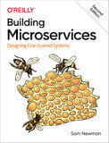       | [**Building Microservices: Designing Fine-Grained Systems**](https://learning.oreilly.com/library/view/-/9781492034018/)   *Sam Newman*   *Second edition published in 2022*   *616 pages*                                          | <ul><li>Microservices</li><li> Architecture</li><li>System design</li></ul> |        |
| 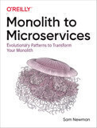    | [**Monolith to Microservices: Evolutionary Patterns to Transform Your Monolith**](https://learning.oreilly.com/library/view/-/9781492047834/)   *Sam Newman*   *Published in 2019*   *270 pages*                                    | <ul><li>Microservices</li><li> Architecture</li><li>System design</li></ul> |        |
| 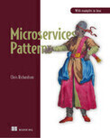       | [**Microservices Patterns**](https://learning.oreilly.com/library/view/-/9781617294549/)   *Chris Richardson*   *Published in 2018*   *520 pages*                                                                                   | <ul><li>Microservices</li><li> Architecture</li><li>System design</li></ul> |        |
| 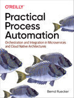 | [**Practical Process Automation: Orchestration and Integration in Microservices and Cloud Native Architectures**](https://learning.oreilly.com/library/view/-/9781492061441/)   *Bernd Ruecker*   *Published in 2021*   *520 pages* | <ul><li>Microservices</li><li> Architecture</li><li>System design</li></ul> |        |

#### System Design

| Cover                                                           | Info                                                                                                                                                                                                                               | Learning Paths                                              | Badges |
| ---                                                             | ---                                                                                                                                                                                                                                | ---                                                         | ---    |
| 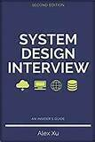            | [**System Design Interview – An insider's guide**](https://www.goodreads.com/book/show/54617137-system-design-interview)   *Alex Xu*   *Published in 2020*   *309 pages*                                                  | <ul><li>[System design](./paths/system-design.md)</li></ul> |        |
| 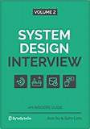          | [**System Design Interview volume 2 – An insider's guide**](https://www.goodreads.com/book/show/60631342-system-design-interview-an-insider-s-guide)   *Alex Xu*   *Published in 2022*   *424 pages*                      | <ul><li>[System design](./paths/system-design.md)</li></ul> |        |
| 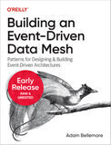 | [**Building an Event-Driven Data Mesh: Patterns for Designing & Building Event-Driven Architectures**](https://learning.oreilly.com/library/view/-/9781098127596/)   *Adam Bellemare*   *Published in 2023*   *275 pages* | <ul><li>System design</li></ul>                             |        |
| 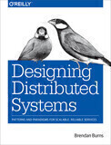      | [**Designing Distributed Systems**](https://www.oreilly.com/library/view/designing-distributed-systems/9781491983638/)   *Brendan Burns*   *Published in 2018*   *162 pages*                                              | <ul><li>System design</li><li>Architecture</li></ul>        |        |

#### APIs

| Cover                                                           | Info                                                                                                                                                                                                                               | Learning Paths                                              | Badges |
| ---                                                             | ---                                                                                                                                                                                                                                | ---                                                         | ---    |
| 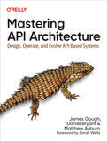 | [**Mastering API Architecture: Defining, Connecting, and Securing Distributed Systems and Microservices**](https://learning.oreilly.com/library/view/-/9781492090625/)   *James Gough, Daniel Bryant and Matthew Auburn*   *Published in 2022*   *286 pages* | <ul><li>API design</li></ul> |
| 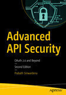      | [**Advanced API Security: OAuth 2.0 and Beyond**](https://learning.oreilly.com/library/view/-/9781484220504/)   *Prabath Siriwardena*   *Published in 2019*   *455 pages*                                                                                    | <ul><li>API design</li></ul> |

#### Serverless

| Cover                                          | Info                                                                                                                                                 | Learning Paths                                  | Badges |
| ---                                            | ---                                                                                                                                                  | ---                                             | ---    |
|  | [**Knative in Action**](https://learning.oreilly.com/library/view/-/9781617296642/)   *Jacques Chester*   *Published in 2021*   *272 pages* | <ul><li>Serverless</li><li>Kubernetes</li></ul> |        |

#### Event Driven Architecture

| Cover                                          | Info                                                                                                                                                 | Learning Paths                                  | Badges |
| ---                                            | ---                                                                                                                                                  | ---                                             | ---    |
| 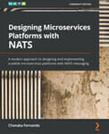 | [**Designing Microservices Platforms with NATS: A modern approach to designing and implementing scalable microservices platforms with NATS messaging**](https://learning.oreilly.com/library/view/-/9781801072212/)   *Chanaka Fernando*   *Published in 2021*   *356 pages* | <ul><li>Event driven architecture</li><li>System design</li></ul> |
| 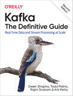 | [**Kafka - The Definitive Guide: Real-Time Data and Stream Processing at Scale **](https://learning.oreilly.com/library/view/-/9781492043072/)   *Gwen Shapira*   *Published in 2021*   *488 pages* | <ul><li>Event driven architecture</li><li>System design</li></ul> |
| 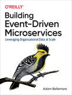 | [**Building Event-Driven Microservices**](https://www.oreilly.com/library/view/building-event-driven-microservices/9781492057888/)   *Adam Bellemare*   *Published in 2020*   *321 pages* | <ul><li>Event driven architecture</li><li>System design</li></ul> |
| 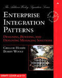 | [**Enterprise Integration Patterns: Designing, Building, and Deploying Messaging Solutions**](https://learning.oreilly.com/library/view/-/0321200683/)   *Hohpe Gregor and Woolf Bobby*   *Published in 2003*   *736 pages* | <ul><li>Event driven architecture</li><li>System design</li></ul> |
|  | [**Enterprise Integration Patterns, Vol 2: Conversation Patterns**]()   *Hohpe Gregor*   *Published in 2018*   *500 pages* | <ul><li>Event driven architecture</li><li>System design</li></ul> |
| 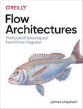 | [**Flow Architectures: The Future of Streaming and Event-Driven Integration**](https://learning.oreilly.com/library/view/-/9781492075882/)   *James Urquhart*   *Published in 2021*   *252 pages* | <ul><li>Event driven architecture</li><li>System design</li></ul> |

### Software architecture

| Cover                                          | Info                                                                                                                                                 | Learning Paths                                  | Badges |
| ---                                            | ---                                                                                                                                                  | ---                                             | ---    |
| 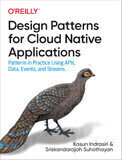 | [**Design Patterns for Cloud Native Applications**](https://learning.oreilly.com/library/view/-/9781492090700/)   *Kasun Indrasiri, Sriskandarajah Suhothayan*   *Published in 2021*   *311 pages* | <ul><li>Software architecture</li><li>System design</li></ul> |
| 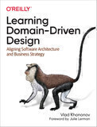 | [**Learning Domain-Driven Design: Aligning Software Architecture and Business Strategy**](https://learning.oreilly.com/library/view/-/9781098100124/)   *Vladik Khononov*   *Published in 2021*   *340 pages* | <ul><li>Software architecture</li><li>System design</li></ul> |

### Software development

| Cover                                          | Info                                                                                                                                                 | Learning Paths                                  | Badges |
| ---                                            | ---                                                                                                                                                  | ---                                             | ---    |
|  | [**Let's Go**](https://lets-go.alexedwards.net/)   *Alex Edwards*   *Published in 2019*   *305 pages* | <ul><li>Software development</li><li>[Golang](./paths/golang.md)</li></ul> |
|  | [**Let's Go Further!**](https://lets-go-further.alexedwards.net/)   *Alex Edwards*   *Published in 2021*   *582 pages* | <ul><li>Software development</li><li>[Golang](./paths/golang.md)</li></ul> |
| 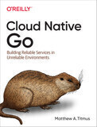 | [**Cloud Native Go**](https://learning.oreilly.com/library/view/-/9781492076322/)   *Matthew A. Titmus*   *Published in 2021*   *433 pages* | <ul><li>Software development</li><li>[Golang](./paths/golang.md)</li></ul> |
| 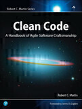 | [**Clean Code: A Handbook of Agile Software Craftsmanship**](https://learning.oreilly.com/library/view/-/9780136083238/)   *Martin Robert*   *Published in 2008*   *464 pages* | <ul><li>Software development</li></ul> |
| 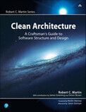 | [**Clean Architecture: A Craftsman's Guide to Software Structure and Design**](https://learning.oreilly.com/library/view/-/9780134494272/)   *Robert C. Martin*   *Published in 2017*   *432 pages* | <ul><li>Software development</li></ul> |

### Kubernetes

| Cover                                          | Info                                                                                                                                                 | Learning Paths                                  | Badges |
| ---                                            | ---                                                                                                                                                  | ---                                             | ---    |
| 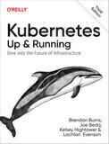 | [**Kubernetes: Up & Running**](https://learning.oreilly.com/library/view/-/9781098110192/)   *Brendan Burns, Joe Beda, Kelsey Hightower*   *Published in 2022*   *326 pages* | <ul><li>Kubernetes</li></ul> |
| 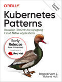 | [**Kubernetes Patterns**](https://learning.oreilly.com/library/view/-/9781098131678/)   *Bilgin Ibryam and Roland Huss*   *Published in 2023*   *300 pages* | <ul><li>Kubernetes</li></ul> |
| 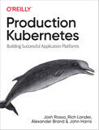 | [**Production Kubernetes**](https://learning.oreilly.com/library/view/-/9781492092292/)   *Josh Rosso, Rich Lander, Alex Brand and John Harris*   *Published in 2021*   *506 pages* | <ul><li>Kubernetes</li></ul> |
| 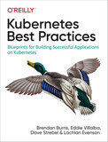 | [**Kubernetes Best Practices**](https://learning.oreilly.com/library/view/-/9781492056461/)   *Brendan Burns, Eddie Villalba, Dave Strebel, Lachlan Evenson*   *Published in 2019*   *268 pages*   Needs update | <ul><li>Kubernetes</li></ul> |
| 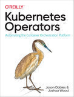 | [**Kubernetes Operators**](https://learning.oreilly.com/library/view/-/9781492048039/)   *Jason Dobies and Joshua Wood*   *Published in 2020*   *154 pages*   Needs update | <ul><li>Kubernetes</li></ul> |
| 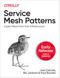 | [**Service Mesh Patterns**](https://learning.oreilly.com/library/view/-/9781492086444/)   *Lee Calcote, Nic Jackson and Paul Bouwer*   *Published in 2023*   *TBD pages* | <ul><li>Kubernetes</li></ul> |

### Observability

| Cover                                          | Info                                                                                                                                                 | Learning Paths                                  | Badges |
| ---                                            | ---                                                                                                                                                  | ---                                             | ---    |
| 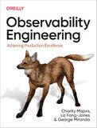 | [**Observability Engineering: Achieving Production Excellence Engineering**](https://www.goodreads.com/book/show/54617137-system-design-interview)   *Charity Majors, Liz Fong-Jones and George Miranda*   *Published in 2022*   *318 pages* | <ul><li>Observability</li></ul> |

#### Certifications

| Cover                                          | Info                                                                                                                                                 | Learning Paths                                  | Badges |
| ---                                            | ---                                                                                                                                                  | ---                                             | ---    |
|  | [**Certified Kubernetes Administrator (CKA) Study Guide**](https://learning.oreilly.com/library/view/-/9781098107215/)   *Benjamin Muschko*   *Published in 2022*   *201 pages* | <ul><li>Certification</li><li>Kubernetes</li></ul> |
| 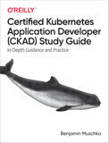 | [**Certified Kubernetes Application Developer (CKAD) Study Guide**](https://learning.oreilly.com/library/view/-/9781492083726/)   *Benjamin Muschko*   *Published in 2021*   *188 pages* | <ul><li>Certification</li><li>Kubernetes</li></ul> |
| 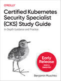 | [**Certified Kubernetes Security Specialist (CKS) Study Guide**](https://learning.oreilly.com/library/view/-/9781098132965/)   *Benjamin Muschko*   *Published in 2023*   *200 pages* | <ul><li>Certification</li><li>Kubernetes</li></ul> |

### DevOps culture

| Cover                                          | Info                                                                                                                                                 | Learning Paths                                  | Badges |
| ---                                            | ---                                                                                                                                                  | ---                                             | ---    |
| 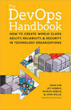 | [**The DevOPS Handbook: How to Create World-Class Agility, Reliability, and Security in Technology Organizations**](https://learning.oreilly.com/library/view/-/9781457191381/)   *Gene Kim, Jez Humble and Patrick Debols*   *Published in 2016*   *480 pages* | <ul><li>DevOps</li></ul> |
| 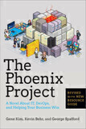 | [**The Phoenix Project**](https://learning.oreilly.com/library/view/-/9781457191350/)   *Gene Kim, Kevin Behr and George Spafford*   *Published in 2013*   *384 pages* | <ul><li>DevOps</li></ul> |
| 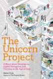 | [**The Unicorn Project**](https://learning.oreilly.com/library/view/-/9781098124175/)   *Gene Kim*   *Published in 2019*   *352 pages* | <ul><li>DevOps</li></ul> |

### Infrastructure as Code (IaC)

| Cover                                          | Info                                                                                                                                                 | Learning Paths                                  | Badges |
| ---                                            | ---                                                                                                                                                  | ---                                             | ---    |
| 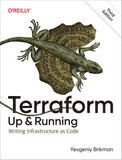 | [**Terraform Up & Running**](https://learning.oreilly.com/library/view/-/9781098116736/)   *Yevgenly Brikman*   *Published in 2022*   *457 pages* | <ul><li>IaC</li></ul> |

### SRE

| Cover                                          | Info                                                                                                                                                 | Learning Paths                                  | Badges |
| ---                                            | ---                                                                                                                                                  | ---                                             | ---    |
| 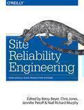 | [**Site Reliability Engineering**](https://sre.google/sre-book/table-of-contents/)   *Betsy Beyer, Chris Jones, Jennifer Petoff and Niall Myrphy*   *Published in 2017*   *unknown pages* | <ul><li>SRE</li></ul> |
| 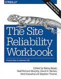 | [**The Site Reliability Workbook**](https://sre.google/workbook/table-of-contents/)   *Betsy Beyer, Niall Myrphy, David K. Rensin, Kent Kawahara and Stephen Thorne*   *Published in 2018*   *unknown pages* | <ul><li>SRE</li></ul> |
| 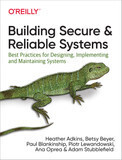 | [**Building Secure & Reliable Systems: Best Practices for Designing, Implementing and Maintaining Systems**](https://static.googleusercontent.com/media/sre.google/en//static/pdf/building_secure_and_reliable_systems.pdf)   *Heather Adkins, Betsy Beyer, Paul Blankship, Piotr Lewandowski, Ana OPera and Adam Stubblefield*   *Published in 2020*   *555 pages* | <ul><li>SRE</li></ul> |

### Other

| Cover                                          | Info                                                                                                                                                 | Learning Paths                                  | Badges |
| ---                                            | ---                                                                                                                                                  | ---                                             | ---    |
|  | [**Accelerate: Building and Scaling High Performing Technology Organizations**](https://www.goodreads.com/book/show/35747076-accelerate)   *Nicole Forsgren*   *Published in 2018*   *288 pages* | <ul><li>Organization design</li></ul> |
| 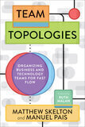 | [**Team Topologies**](https://teamtopologies.com/book)   *Matthew Skelton, Manuel Pais*   *Published in 2019*   *240 pages* | <ul><li>Product Management</li><li>Organization</li></ul> |
| 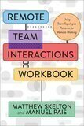 | [**Remote Teams Interactions Workbook**](https://teamtopologies.com/workbook)   *Matthew Skelton, Manuel Pais*   *Published in 2022*   *80 pages* | <ul><li>Organization</li></ul> |

