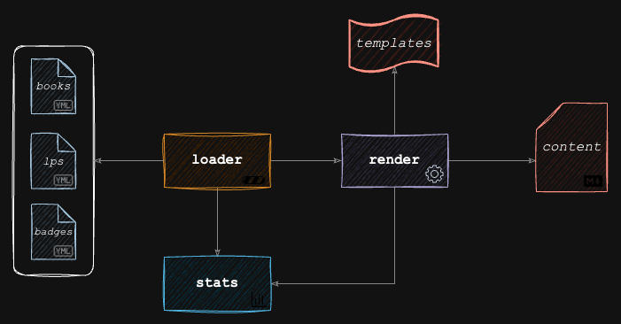

# Choose Your Own IT Readventure! (the making of)

The magic is performed thanks to go and its templating engine. The workflow basically consists in loading data from yaml files and use it to render the templates into markdown files.

I made this simple application to make easier adding content avoiding the toil of maintaining the format. Documenting in markdown is fast and friendly, but no matter how light the engine, the task of adding dozens of rows is tedious, error prone and plainly boring. I hate monkey work :monkey_face:.

## Architecture

Components:
- *input*:
  - **yaml** files: contains all books, learning paths and badges information.
- *core*:
  - **loader**: reads the `yaml` files and load the data into go structs.
  - **stats**: keeps count of books, authors and learning paths.
  - **render**: uses the loaded data, the stats and the assets (book covers, icons, etc) to render the `templates` and produce the final markdown `content`.
- *output*:
  - **content** files: the result of the rendering process in markdown format.
 

    

